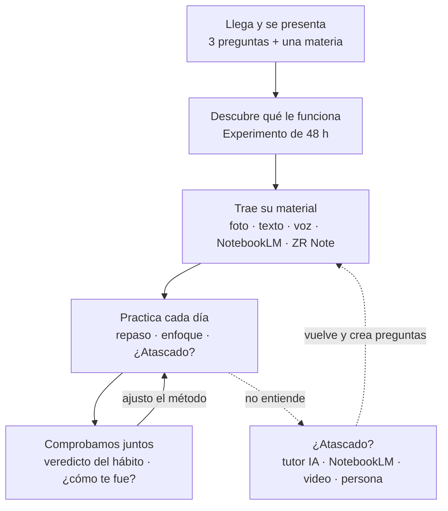

# Cómo funciona Catedra (MVP) y qué te toca a ti

Fecha: 2026-10-08. Complementa `evaluacion-realidad-mvp.md`. **[V]** verificado en fuente, **[C]** conocimiento previo, **[D]** juicio propio.

---

## 1. Lo que corregimos de la evaluación anterior

Tu objeción era correcta en lo esencial:

| Tu punto | Qué dice la evidencia | Cómo cambia el producto |
|---|---|---|
| "No lo pregunta porque no sabe que existen otros métodos" | Solo 18 % de los estudiantes encuestados por Kornell y Bjork (2007) usaba autoevaluarse *porque aprende más así* [V, vía resumen]. Además, la mayoría cree que releer funciona mejor. | Sí hay un desconocimiento real. |
| …pero decírselo no basta | Incluso cuando su propio resultado muestra lo contrario, la gente sigue creyendo que su método de siempre es mejor (Yan, Bjork y Bjork 2016) [V]. Releer **gana** si te preguntan a los 5 minutos; recordar gana a los 2 días y a la semana (Roediger y Karpicke 2006) [V]. Por eso, lo que se siente al estudiar engaña. | No basta con *contarle* los métodos: tiene que **verlo en sí mismo, con espera**. → **Experimento de 48 h**. |
| "El método que más se adapte a ti" | Adaptar según "estilos de aprendizaje" (visual, auditivo…) **no tiene evidencia** (Pashler y col. 2008) [V]. | Adaptamos según *contexto y resultados propios* (tiempo, tipo de evaluación, tipo de materia, qué te funcionó), **nunca** por estilo. Hay que evitar esa promesa en el marketing. |
| "Enfocarnos en un examen que no se sabe cómo será es complejo" | Correcto: el examen es incierto, y no todos tienen uno cerca. | El examen es **opcional**. El ancla por defecto es tu semana (meta de enfoque + repaso). Si hay evaluación, la app te ayuda a *averiguar cómo será* antes de planificar. |
| "Nadie unifica lo que hacen las apps de IA" | Hay estudios pequeños: estudiantes que pierden hasta 16 de cada 120 min cambiando de app y que piden un sistema integrado [V, muestra no reportada]. | No competimos con ChatGPT, Gemini ni NotebookLM: **los orquestamos**. Catedra decide qué herramienta conviene, te prepara la instrucción y te trae de vuelta a evaluarte. → **¿Atascado?** |

**La nueva promesa [D]:** *"Tu copiloto de estudio: descubre qué te funciona a ti, úsalo cada día con tu material y con las herramientas que ya tienes, y comprueba si te está sirviendo."*

---

## 2. Cómo funciona, paso a paso

**Día 0 (5 minutos)**
1. Llega → 3 preguntas visuales → una idea con fuente → nombre y primera materia (fecha de evaluación opcional).
2. Hoy le ofrece **"Descubre qué te funciona · 4 min"**: dos textos cortos (Salto Ángel y la danza de las abejas). Uno lo relee dos veces y el otro lo lee una vez y lo recuerda sin mirar. Antes de empezar apuesta cuál recordará más.
3. Añade el material de su clase (pegar, foto, voz, PDF, NotebookLM o paquete de ZR Note) → la app propone preguntas → él aprueba las que quiere.

**Días 1–2**
4. Hoy muestra **una sola cosa**: repasar lo que vence, una sesión de enfoque de 15 min o el siguiente paso. Cada sesión termina con *"siguiente paso"* de un toque.
5. Si no entiende algo → **¿Atascado?** → elige entre tutor con IA (copia la instrucción socrática y abre ChatGPT o Gemini), NotebookLM, un video o preguntarle a alguien (con la pregunta ya redactada) → *"Ya lo entendí: crear preguntas"*.

**Día 2 — el momento clave**
6. Hoy cambia a **"¿Qué te funcionó a ti?"** → 8 preguntas → ve sus barras: recordar contra releer, y si su apuesta fue correcta. Esto convierte la teoría en algo que creyó por sí mismo.

**Semanas siguientes**
7. Hábito de 1–2 semanas (prueba → veredicto con sus datos), racha semanal de enfoque, ruta por fases si hay evaluación, *"averigua qué entra"*.
8. Pasada la evaluación: **"¿Cómo te fue?"** (carita, si llegó preparado y nota opcional). Es el dato que dice si Catedra sirve.
9. Encuestas cortas: *"¿Te está funcionando?"*

---

## 3. Qué te toca a ti (en orden)

> **Esta es tu lista.** Ábrela cuando dudes de qué sigue. Última actualización: 2026-10-08.

| # | Tarea | Por qué | Tiempo |
|---|---|---|---|
| 1 | **Activar la IA (ver §3.1 abajo)** y la medición: `POSTHOG_KEY`, `FEEDBACK_URL`. | Sin IA las preguntas son plantillas y no hay preguntas de aplicación; sin analítica el piloto no enseña nada. | 20–30 min |
| 2 | Probar en **tu teléfono**: experimento completo (puedes adelantar la fecha solo en pruebas), enfoque saliendo de la app, ¿Atascado? | Detectar lo que solo falla en un teléfono real. | 30 min |
| 3 | **10 entrevistas** (ver §8 de la evaluación). Pregunta extra: *"¿Sabías que intentar recordar funciona mejor que releer? ¿Lo haces?"* | Confirma o refuta tu hipótesis del desconocimiento. | 1 semana |
| 4 | **2–3 academias o preparadurías**: ¿pagarían por saber qué alumnos van atrasados o por darles esto? | El dinero probable está ahí. | 1 semana |
| 5 | Reclutar **12–20 estudiantes** para el piloto, con grupo de WhatsApp y enlace con `?c=CODIGO`. | Piloto concierge: tú les escribes cada día. | 2–3 semanas |
| 6 | Revisar cada semana: activación, días de uso, % que termina el experimento, resultados de "¿Cómo te fue?". | Decidir si seguir, ajustar o pivotar. | 1 h/semana |

**Lo que me toca a mí:** arreglar lo que salga de tus pruebas, el aviso de instalación en iPhone, sumar los resultados de las evaluaciones y los "puentes" al panel "¿Te está funcionando?" y, cuando tengas las claves, verificar la IA real en producción.

### 3.1 La IA, sin complicarte (20 minutos)

**Cuál usar:** **Groq** como principal (modelo Llama 3.3 70B, gratis; las fuentes de 2026 coinciden en ~1.000 pedidos al día y 100.000 tokens/día en el plan gratis [fuentes secundarias]) y **Gemini** como respaldo y para leer fotos. La app ya prueba una y, si falla, la otra. No tienes que programar nada.

| Paso | Qué haces |
|---|---|
| 1 | Entra a **console.groq.com** → crea cuenta gratis → *API Keys* → *Create API Key* → cópiala. |
| 2 | (Opcional, para fotos) **aistudio.google.com** → *Get API key* → cópiala. |
| 3 | Abre `docs/product/pegar-en-vercel.txt`, pega cada clave después de su `=`, e inventa 3 códigos de piloto en `PILOT_CODES`. **Nunca pegues las claves en un chat.** |
| 4 | Vercel → proyecto *catedra* → *Settings* → *Environment Variables* → pega todo el bloque → *Save*. |
| 5 | *Deployments* → ⋯ del último → *Redeploy*. |
| 6 | Comprueba: `https://catedra-flame.vercel.app/api/ai?check=1&c=TU_CODIGO` debe decir `"ok":true`. Luego abre `https://catedra-flame.vercel.app/app?c=TU_CODIGO`, pega un texto y genera preguntas: si no dicen "Sin IA", funciona. |

**Cuidado con la privacidad:** en los planes gratis, Google puede usar lo que se envía para mejorar sus productos (fuera de Europa). La política de privacidad ya lo avisa. Si no lo quieres, activa `AI_NO_GEMINI_TEXT=1` y el texto irá solo a Groq.

**Qué hace la IA ahora:** genera preguntas según el área de la materia (ejercicios en números, causas en sociales, idea principal en lengua, los tres niveles en química) y al menos una pregunta que lleva el concepto a una situación de la vida real.

---

## 5. Por materia y "¿para qué me sirve?" (lo nuevo)

| Lo que pediste | Qué dice la evidencia | Cómo quedó en la app |
|---|---|---|
| Mostrar dónde y cuándo va a usar lo que aprende | Escribir para qué te sirve lo que estudias subió interés y notas en 9.º grado, **sobre todo en quienes dudaban de sí mismos** (Hulleman y Harackiewicz, 2009) [V]. Pero **decírselo directamente** puede desanimar justo a esos estudiantes; lo que ayuda es que lo genere él, y las ideas dadas funcionan mejor *después* (Canning y Harackiewicz, 2015) [V]. Las situaciones cotidianas ayudaron más que las de carrera [V, resumen secundario]. | **Puente:** al terminar un repaso, una vez por semana por materia, Catedra pregunta "¿Dónde ves pasar esto de Química?". El estudiante escribe una línea y, si quiere, pide ideas. Después Catedra se lo recuerda cuando repasa: "Tú me dijiste que te sirve para…". La IA además crea preguntas de aplicación a la vida diaria. |
| Castellano no es Matemáticas ni Química | Ejercicios mezclados en matemáticas: 61 % contra 38 % un mes después (Rohrer y col., 2020; 787 estudiantes) [V]. Ejemplos resueltos: efecto medio en matemáticas (g = 0,48; Barbieri y col., 2023) [V]. Comprensión lectora: preguntarse y resumir, efectos moderados a grandes, mayores en quien tiene dificultades [V]. Química: lo difícil es moverse entre lo que se ve, las partículas y los símbolos (Johnstone) [V; evidencia de intervención limitada]. Evaluarse y repartir funcionan en casi todo, aunque se midieron sobre todo con hechos, no con comprensión profunda (Donoghue y Hattie, 2021) [V]. | **Áreas:** cada materia se clasifica sola por su nombre (se puede cambiar) en Números y problemas, Química, Ciencias de la vida, Lengua e idiomas, Sociales, u Otra. Cada área trae su consejo, la evidencia y los métodos ordenados; el recomendador de la sesión de enfoque los prioriza. Dos métodos nuevos: *Pregúntate y resume* y *Lo que ves, las partículas y la fórmula*. |

## 6. Página de inicio y cuentas

- **`/` es ahora la página de inicio**: explica qué es Catedra antes de entrar. La app vive en **`/app`**. Quien ya la usa o la tiene instalada entra directo a la app. Los códigos de piloto (`?c=`) se conservan.
- **Cuentas, mi opinión:** todavía no. Para un piloto de 20 personas, una cuenta agrega fricción (más gente abandona antes de empezar), obligaciones de privacidad y trabajo de sincronización, sin enseñarnos nada nuevo. La página dice la verdad: "sin registro; tus datos en tu teléfono; puedes respaldarlos". **Cuándo sí:** cuando el piloto muestre que vuelven (umbrales del §8 de la evaluación). Entonces lo natural es Supabase (inicio con enlace al correo, sin contraseña) y sincronización; eso necesita que tú abras la cuenta y decidas el costo.

---

## Fuentes
- Kornell y Bjork (2007) y Hartwig y Dunlosky (2012), resumen: https://www.learningscientists.org/blog/2018/2/8-1 · original: https://Www.Gwern.net/doc/psychology/spaced-repetition/2012-hartwig.pdf
- Yan, Bjork y Bjork (2016): https://sites.lifesci.ucla.edu/psych-bjorklab/wp-content/uploads/sites/13/2016/11/YanBjorkBjork2016.pdf
- Roediger y Karpicke (2006): https://psychology.ecu.edu/wp-content/pv-uploads/sites/216/2019/03/Roediger-Karpicke-2006.pdf
- Pashler y col. (2008), estilos de aprendizaje: https://digitalcommons.usf.edu/psy_facpub/1765/ · https://deansforimpact.org/learning-styles-what-does-the-research-say/
- Cambio entre apps al estudiar (2025): https://proceedings.aijr.org/index.php/ap/article/view/92
- McDaniel y Einstein (2020): https://journals.sagepub.com/doi/10.1177/1745691620920723

---

## 4. Esquema de procesos

Catedra habla como un profe en primera persona (decisión del 2026-10-08): una idea por burbuja, y el estudiante responde con un toque. Siempre puede decir "Ahora no".

**Qué propone Catedra hoy:** revisa en orden y propone lo primero que aplique: experimento listo → repaso que vence → preguntas por revisar → material sin convertir → evaluación cercana (averigua qué entra) → resultado de una evaluación pasada → enfoque semanal → descanso.

**Dónde viven los datos:** todo en el teléfono (IndexedDB, funciona sin conexión). Al servidor solo van el texto que el estudiante pide convertir con IA (`/api/ai`, sin guardarlo) y eventos anónimos de uso, sin texto (`/api/e` → PostHog). El respaldo se hace desde Progreso → Respaldar.

## Fuentes (actualización)
- Hulleman y Harackiewicz (2009), utilidad percibida: https://pmc.ncbi.nlm.nih.gov/articles/PMC5589190
- Canning y Harackiewicz (2015), "Teach it, don't preach it": https://pmc.ncbi.nlm.nih.gov/articles/PMC4610746
- Rohrer y col. (2020), práctica intercalada en matemáticas (revisión WWC): https://ies.ed.gov/ncee/WWC/Study/80702
- Barbieri y col. (2023), ejemplos resueltos: https://www.learningscientists.org/blog/2024/1/25-1
- Comprensión lectora, metaanálisis: https://ir.vanderbilt.edu/items/1adf5d6c-1758-4732-83a9-e837a49616c7 · https://apps.asha.org/EvidenceMaps/Articles/ArticleSummary/24580a55-4e21-4b20-a910-b8fda606eccd
- Triángulo de Johnstone (RSC): https://edu.rsc.org/feature/improve-students-understanding-with-johnstones-triangle/4019740.article
- Donoghue y Hattie (2021): https://www.frontiersin.org/articles/10.3389/feduc.2021.581216/pdf
- Límites gratis de Groq (secundario): https://aireiter.com/blog/best-free-ai-api · Gemini (oficial, sin cifras): https://ai.google.dev/docs/increase_quota
